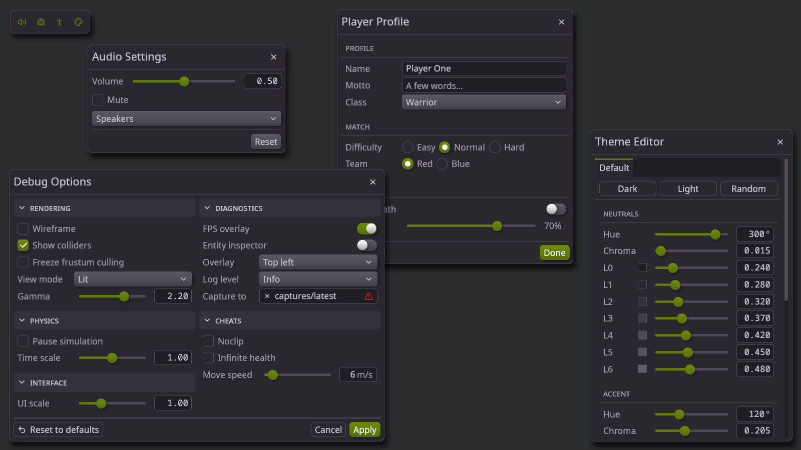
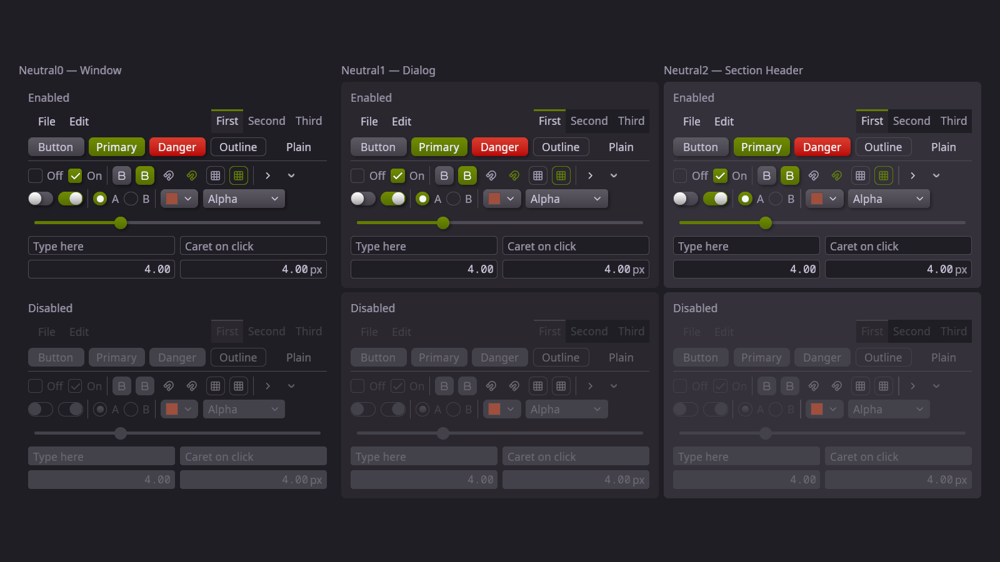
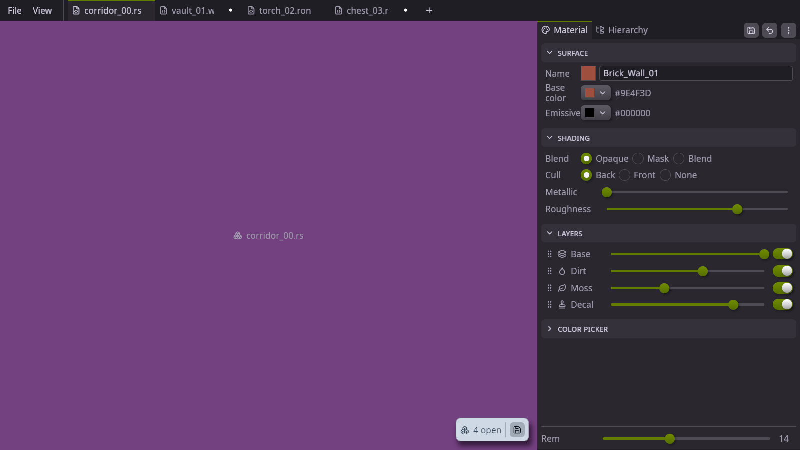
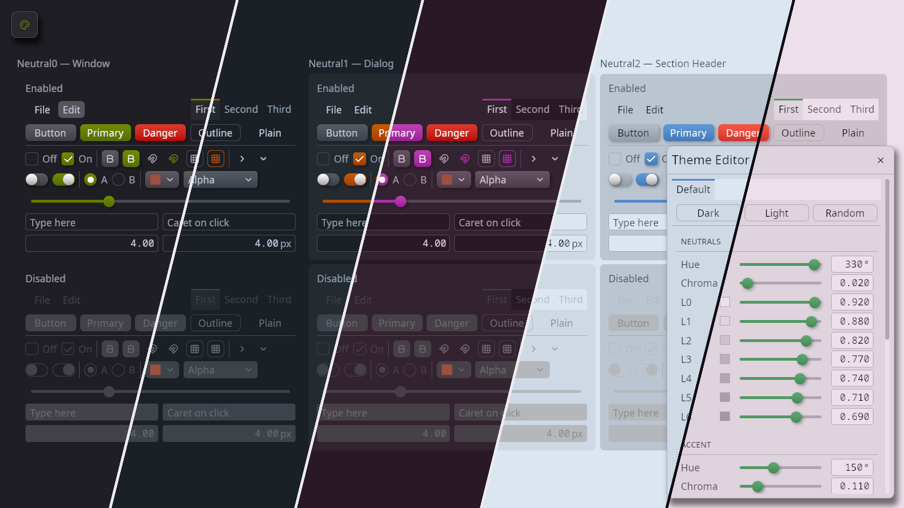

# bevy_jp_plume ("Plume")

A bevy_ui control framework with an immediate mode front-end for game debug UI. 
Forked from `bevy_feathers` and diverging deliberately.

Original code MIT OR Apache-2.0 (see LICENSE-MIT / LICENSE-APACHE).

See CLAUDE.md for the design rules that distinguish Plume from feathers.

## Screenshots

The showcase example — the feature dialogs floating over the debug hub:

The gallery example — every control in its enabled and disabled state, on each
of the three neutral surfaces:

The inspector_panel example — a docked editor panel built from tabs, splitter,
sections and the color widgets:

Simple theme editor:

## Widgets

Every widget is available in both modes: retained scenes built with `bsn!`
(names from `bevy_jp_plume::retained`; `PlumeXxx` is a scene component spawned
as `@PlumeXxx { … }` with a matching `PlumeXxxProps`, lowercase names are scene
functions spawned as `@name(…)`), and immediate mode (from
`bevy_jp_plume::prelude`). `—` marks a side that has no public counterpart.

In the immediate column:

- `root` is the `PlumeRoot` system param; it opens the top-level surfaces.
- `ui` is the `Ui` a surface hands its closure; it builds the widgets inside.
- `response` is what every `ui.…` call returns; it carries the result
  (`.clicked`, `.changed`) and chains per-widget extras (`.tooltip(…)`,
  `.popup(…)`).

### Containers

| Widget | Retained | Immediate |
| ------ | -------- | --------- |
| Screen | `screen()` | `root.screen(\|ui\| …)` |
| Row | `row()` | `ui.horizontal(\|ui\| …)` |
| Column | `column()` | `ui.vertical(\|ui\| …)` |
| Dialog | `PlumeDialog` | `root.dialog(title, &mut open).show(\|ui\| …)` |
| Modal | `PlumeModal`, `modal_title()` | `root.modal(title, &mut open).show(\|ui\| …)` |
| Panel (headerless surface) | `PlumeDialog` with `header: false` | `root.panel().show(\|ui\| …)` |
| Popup | `PlumePopup`, `popup_socket()`, `close_popup(commands, entity)` | `response.popup(&mut open)` |
| Scroll area | `PlumeScrollArea` | `ui.scroll_area_vertical(\|ui\| …)` / `ui.scroll_area_horizontal(\|ui\| …)` |
| Section | `PlumeSection` | `ui.section("Header", \|ui\| …)` |
| Splitter | `PlumeSplitter`, `SplitPane` | `ui.split_horizontal(&mut split, \|ui\| …, \|ui\| …)` / `ui.split_vertical(…)` |
| Tabs | `PlumeTabs`, `PlumeTab`, `tab_label()`, `tab_body()` | `ui.tabs(&mut selected, \|tabs\| …)` |
| Reorderable list | `PlumeReorderable`, `PlumeReorderableItem` | `ui.reorderable(&mut items, key_fn, \|ui, item\| …)` |

### Controls

| Widget | Retained | Immediate |
| ------ | -------- | --------- |
| Button | `PlumeButton` | `ui.button("Label")` |
| Icon button | `PlumeButton` with icon + caption children | `ui.icon_button(lucide::…, "Label")` |
| Tool button | `PlumeToolButton` | `ui.tool_button(lucide::…)` |
| Checkbox | `PlumeCheckbox` | `ui.checkbox(&mut flag, "Label")` |
| Radio | `PlumeRadioGroup`, `PlumeRadio` | `ui.radio(&mut value, Variant, "Label")` |
| Toggle switch | `PlumeToggleSwitch` | `ui.toggle(&mut flag)` |
| Slider | `PlumeSlider` | `ui.slider(&mut value, 0.0..=1.0)` |
| Number input | `PlumeNumberInput` | `ui.number(&mut value)` |
| Text input | `PlumeTextInput` | `ui.text_edit(&mut text)` |
| Select | `PlumeSelect`, `select_options()` | `ui.select(&mut selected, \|sel\| …)` |
| Color edit | `PlumeColorEdit` | `ui.color_edit(&mut color)` (`_rgb` variant) |
| Color picker | `PlumeColorPicker` | `ui.color_picker(&mut color)` (`_rgb` variant) |
| Color swatch | `PlumeColorSwatch` | `ui.color_swatch(color)` (`_rgb` variant) |
| Disclosure | `PlumeDisclosure` | `ui.disclosure(&mut open)` |
| Menu | `PlumeMenuBar`, `PlumeMenuButton`, `menu_anchor()` | `ui.menu_bar(\|bar\| …)` |
| Scrollbar | `PlumeScrollbar` | — (scroll areas manage their own) |

### Display

| Widget | Retained | Immediate |
| ------ | -------- | --------- |
| Caption | `caption("text")` | `ui.caption("text")` |
| Icon | `icon(lucide::…)` | `ui.icon(lucide::…)` |
| Separator | `separator()` | `ui.separator()` |
| Space | `space(length)` | `ui.space(length)` |
| Flex spacer | `flex_spacer()` | `ui.flex_spacer()` |
| Tooltip | `Tooltip("text")` / `TooltipContent` components on the target control | `response.tooltip("text")` / `response.tooltip_container(\|ui\| …)` |

## Fonts

Plume bundles its fonts as embedded assets, so they end up inside any binary
built against it. Their licenses are separate from the crate's MIT/Apache-2.0
and travel with anything you ship.

| Font | Copyright | License |
| ---- | --------- | ------- |
| Noto Sans, Noto Sans Mono | The Noto Project Authors | [SIL OFL 1.1](src/assets/fonts/NotoSans-LICENSE.txt) |
| Lucide | Lucide Icons and Contributors | [ISC](src/assets/fonts/Lucide-LICENSE.txt) |

Both licenses require that the copyright notice and license text accompany
redistribution. A subset of Lucide's icons is MIT (inherited from Feather;
both notices are in its license file).
